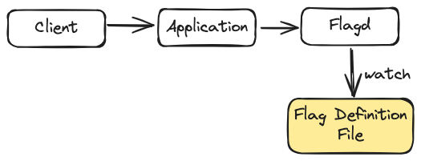

# Lab01



> [What is flagd?](https://flagd.dev/)

## Start flagd container

```
docker run \
  --rm -d \
  --name flagd \
  -p 8013:8013 \
  -v $(pwd):/etc/flagd \
  ghcr.io/open-feature/flagd:latest start \
  --uri file:./etc/flagd/demo.flagd.json
```

## Evaluating a feature flag

get boolean

```
curl -X POST "http://localhost:8013/flagd.evaluation.v1.Service/ResolveBoolean" \
  -d '{"flagKey":"feature-a","context":{}}' -H "Content-Type: application/json"
```

get string

```
curl -X POST "http://localhost:8013/flagd.evaluation.v1.Service/ResolveString" \
 -d '{"flagKey":"feature-a","context":{}}' -H "Content-Type: application/json"
```

## Build and start the application

```
cd lab01
npm install
npm run build
npm run start
```

Invoke the `/ping` API

```
curl http://localhost:8888/ping
```

Than modify the flagd config file
